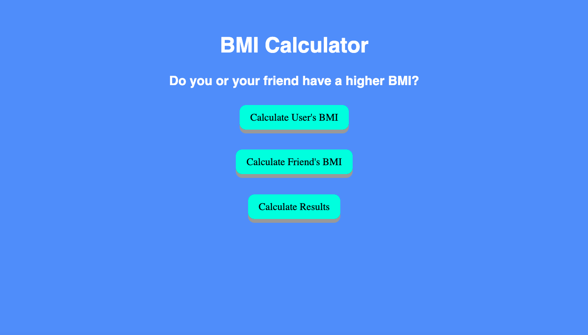

# BMI Calculator 2

Utilizing Object Methods

## Description:

Welcome back to the BMI Calculator Coding Challenge, this time we utilized JavaScript Objects. While the original challenge requested, I take two sets of predetermined values, calculate the two BMI's, and then determine if the first BMI was more than the other BMI, I decided we should do more, and is why I let you, the user, enter your own custom values.  None of the above information would be displayed on the webpage, and I wanted more, so when you click on the individual buttons, the user is provided information not originally requested of this original challenge. I find it important to practice things I previously learned, as well as current topics. I have found myself increasingly comfortable with past lessons and becoming efficient with said lessons.
 
## What I Learned:

1. In this challenge/lesson, I learned about JavaScript Object's and their methods. Jonas from, "The Complete JavaScript Course 2022", explained that the difference between Objects and Arrays is that the location of the key value pairs. Within Objects, the key value pairs do not matter where they are positioned within the Object, unlike arrays, where the elements within the Array does matter. Furthermore, when Objects are displayed in the console, that they are in alphabetical order. 

2. Key value pairs within an Object must end in a comma or a bug will be created. Objects can have a child that is an Array, and they can also hold function expressions. Jonas also explained that it is ideal to type, "this." when referring to the object the value is nested in. Doing "this." will prevent future bugs whenever the Objects name is changed in the future, otherwise you would have to change the names within the function expression. Failing to do so will result in bugs.

3. I also learned the differences between Dot Notation and Bracket Notation. A person utilizes Dot Notation when a property has a set value, and to retrieve it from an Object. Bracket Notation is used with an expression. Bracket Notation is great with concatenating strings. As well as, capturing values within a key/property of an Object, and then using Bracket Notation to output the data.

## What I Added:

1. I added three buttons to this challenge titled, "Calculate User's BMI", "Calculate Friend's BMI", and "Calculate Results". Once the page is loaded, the values are entered in by the user, and the individual buttons call on three separate functions, two of which are within two separate Objects. The “Calculate User’s BMI” and “Calculate Friend’s BMI” calculate each person's BMI. The “Calculate Results” Button compares who has the higher BMI and outputs the results.

2. Once the BMI’s are generated, it will be displayed in a hidden h6, under a class, that will output the BMI’s as well as if you're at a healthy weight, utilizing If Else Statements and Template Literals.

3. If the user inputs an invalid input, a Ternary Operator will detect this and output, "You entered an invalid input". As well as, if the user inputs an invalid input of any kind, when they click "Results", they will be advised of an invalid input.

4. When the results button is pressed, I have the outputs displayed in different colors, Red for if you have a higher BMI than your friend, Green if your friend has a higher BMI than you, Yellow if its a draw, and I left a default White for if there was an invalid input. This was a good refresher for how to change the text color.

Check out the new version of the BMI Calculator Today! https://coderortiz.github.io/bmi_calculator-2/

